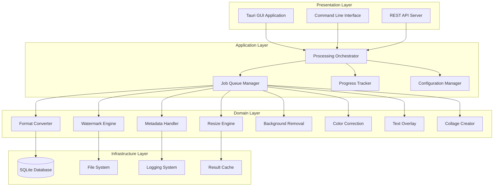

# Image Processor - Detailed Technical Documentation

## Table of Contents

- [Architecture Overview](#architecture-overview)
- [Core Components](#core-components)
- [Processing Engines](#processing-engines)
- [API Reference](#api-reference)
- [Configuration Guide](#configuration-guide)
- [Performance Optimization](#performance-optimization)
- [Security Considerations](#security-considerations)
- [Development Guide](#development-guide)
- [Testing Strategy](#testing-strategy)
- [Deployment Guide](#deployment-guide)
- [Troubleshooting](#troubleshooting)

## Architecture Overview

### System Architecture

The Image Processor follows a modular, layered architecture designed for high performance, scalability, and maintainability:



### Design Principles

1. **Performance First**: All operations optimized for speed and memory efficiency
2. **Streaming Processing**: Handle large files without loading entirely into memory
3. **Parallel Processing**: Utilize all available CPU cores for batch operations
4. **Hardware Acceleration**: Leverage GPU when available for supported operations
5. **Modular Architecture**: Separate concerns for easy testing and maintenance
6. **Cross-Platform**: Consistent behavior across Windows, macOS, and Linux
7. **Type Safety**: Leverage Rust's type system for memory safety and correctness

## Core Components

### Processing Orchestrator

The central coordinator that manages all image processing operations:

```rust
pub struct ProcessingOrchestrator {
    processors: HashMap<ProcessorType, Box<dyn ImageProcessor>>,
    job_queue: Arc<JobQueue>,
    progress_tracker: Arc<ProgressTracker>,
    cache: Arc<ResultCache>,
    config: Arc<AppConfig>,
}

impl ProcessingOrchestrator {
    pub async fn new() -> Result<Self, ProcessingError> {
        // Initialize all processors
        // Set up job queue and progress tracking
        // Load configuration
    }
    
    pub async fn process_file(
        &self,
        input_path: &Path,
        output_path: &Path,
        operations: Vec<ProcessingOperation>,
    ) -> Result<ProcessingResult, ProcessingError> {
        // Validate input file
        // Create processing job
        // Execute operations pipeline
        // Return results
    }
    
    pub async fn process_batch(
        &self,
        batch: BatchProcessingRequest,
    ) -> Result<BatchProcessingResult, ProcessingError> {
        // Process multiple files concurrently
        // Manage resource allocation
        // Provide progress updates
    }
}
```

### Job Queue System

Manages concurrent processing with priority scheduling:

```rust
pub struct JobQueue {
    pending: VecDeque<ProcessingJob>,
    active: HashMap<JobId, ProcessingJob>,
    completed: Vec<JobResult>,
    max_concurrent: usize,
    worker_pool: ThreadPool,
}

pub struct ProcessingJob {
    pub id: JobId,
    pub input_path: PathBuf,
    pub output_path: PathBuf,
    pub operations: Vec<ProcessingOperation>,
    pub priority: JobPriority,
    pub created_at: DateTime<Utc>,
    pub progress: Arc<Mutex<ProcessingProgress>>,
}

#[derive(Debug, Clone, PartialEq, Eq, PartialOrd, Ord)]
pub enum JobPriority {
    Low = 0,
    Normal = 1,
    High = 2,
    Critical = 3,
}
```

### Progress Tracking

Real-time progress monitoring with ETA calculations:

```rust
pub struct ProgressTracker {
    active_jobs: HashMap<JobId, JobProgress>,
    event_sender: broadcast::Sender<ProgressEvent>,
}

pub struct JobProgress {
    pub job_id: JobId,
    pub current_operation: String,
    pub operations_completed: usize,
    pub total_operations: usize,
    pub bytes_processed: u64,
    pub total_bytes: u64,
    pub start_time: Instant,
    pub estimated_completion: Option<Instant>,
    pub processing_speed: f64, // MB/s
}

#[derive(Debug, Clone)]
pub enum ProgressEvent {
    JobStarted(JobId),
    OperationStarted { job_id: JobId, operation: String },
    ProgressUpdate { job_id: JobId, progress: JobProgress },
    OperationCompleted { job_id: JobId, operation: String },
    JobCompleted { job_id: JobId, result: ProcessingResult },
    JobFailed { job_id: JobId, error: ProcessingError },
}
```

## Processing Engines

### Format Converter

High-performance format conversion using libvips:

```rust
pub struct FormatConverter {
    vips_context: VipsContext,
    supported_formats: HashSet<ImageFormat>,
    quality_presets: HashMap<QualityPreset, QualitySettings>,
}

impl ImageProcessor for FormatConverter {
    async fn process(&self, input: ProcessingInput) -> Result<ProcessingOutput, ProcessingError> {
        match input.operation {
            ProcessingOperation::Convert { format, quality } => {
                self.convert_format(input.source, format, quality).await
            }
            _ => Err(ProcessingError::UnsupportedOperation),
        }
    }
    
    fn supports_format(&self, format: ImageFormat) -> bool {
        self.supported_formats.contains(&format)
    }
}

impl FormatConverter {
    async fn convert_format(
        &self,
        source: ProcessingSource,
        target_format: ImageFormat,
        quality: Option<u8>,
    ) -> Result<ProcessingOutput, ProcessingError> {
        // Stream-based conversion for memory efficiency
        // Hardware acceleration when available
        // Quality optimization based on format
    }
}
```

### Watermark Engine

Advanced watermarking with multiple positioning options:

```rust
pub struct WatermarkEngine {
    blend_modes: HashMap<BlendMode, BlendFunction>,
    position_calculator: PositionCalculator,
    cache: LruCache<WatermarkCacheKey, ProcessedWatermark>,
}

pub struct WatermarkConfig {
    pub watermark_path: PathBuf,
    pub positions: Vec<WatermarkPosition>,
    pub opacity: f32,
    pub scale: f32,
    pub blend_mode: BlendMode,
    pub effects: Vec<WatermarkEffect>,
}

#[derive(Debug, Clone)]
pub enum WatermarkPosition {
    TopLeft { offset_x: i32, offset_y: i32 },
    TopRight { offset_x: i32, offset_y: i32 },
    BottomLeft { offset_x: i32, offset_y: i32 },
    BottomRight { offset_x: i32, offset_y: i32 },
    Center { offset_x: i32, offset_y: i32 },
    Custom { x: i32, y: i32 },
    Percentage { x_percent: f32, y_percent: f32 },
}

#[derive(Debug, Clone)]
pub enum BlendMode {
    Normal,
    Multiply,
    Screen,
    Overlay,
    SoftLight,
    HardLight,
    ColorDodge,
    ColorBurn,
}
```

### Background Removal Engine

AI-powered background removal using ONNX Runtime:

```rust
pub struct BackgroundRemovalEngine {
    onnx_session: Arc<onnxruntime::Session>,
    model_type: BgRemovalModel,
    preprocessing: ImagePreprocessor,
    postprocessing: ImagePostprocessor,
    gpu_available: bool,
}

#[derive(Debug, Clone)]
pub enum BgRemovalModel {
    U2Net,
    MODNet,
    Custom { path: PathBuf, input_size: (u32, u32) },
}

impl BackgroundRemovalEngine {
    pub async fn new(model: BgRemovalModel) -> Result<Self, ProcessingError> {
        // Load ONNX model
        // Initialize preprocessing pipeline
        // Detect GPU availability
    }
    
    pub async fn remove_background(
        &self,
        input: &DynamicImage,
    ) -> Result<BackgroundRemovalResult, ProcessingError> {
        // Preprocess image for model input
        // Run inference
        // Post-process mask
        // Apply mask to original image
    }
}

pub struct BackgroundRemovalResult {
    pub image_with_transparent_bg: DynamicImage,
    pub mask: GrayImage,
    pub confidence_score: f32,
}
```

### Metadata Handler

Comprehensive metadata management:

```rust
pub struct MetadataHandler {
    exif_reader: ExifReader,
    iptc_handler: IptcHandler,
    xmp_processor: XmpProcessor,
}

pub struct ImageMetadata {
    pub exif: Option<ExifData>,
    pub iptc: Option<IptcData>,
    pub xmp: Option<XmpData>,
    pub custom: HashMap<String, String>,
    pub processing_history: Vec<ProcessingHistoryEntry>,
}

#[derive(Debug, Clone, Serialize, Deserialize)]
pub struct ProcessingHistoryEntry {
    pub operation: String,
    pub timestamp: DateTime<Utc>,
    pub parameters: serde_json::Value,
    pub software_version: String,
}

impl MetadataHandler {
    pub async fn read_metadata(&self, path: &Path) -> Result<ImageMetadata, ProcessingError> {
        // Read EXIF data
        // Parse IPTC information
        // Extract XMP metadata
        // Combine into unified structure
    }
    
    pub async fn write_metadata(
        &self,
        path: &Path,
        metadata: &ImageMetadata,
    ) -> Result<(), ProcessingError> {
        // Write EXIF data
        // Embed IPTC information
        // Add XMP metadata
        // Preserve existing data where appropriate
    }
}
```

## API Reference

### Core Processing API

#### ProcessingOrchestrator

The main entry point for all processing operations:

```rust
impl ProcessingOrchestrator {
    // Create new orchestrator instance
    pub async fn new() -> Result<Self, ProcessingError>;
    
    // Process single file
    pub async fn process_file(
        &self,
        input_path: &Path,
        output_path: &Path,
        operations: Vec<ProcessingOperation>,
    ) -> Result<ProcessingResult, ProcessingError>;
    
    // Process multiple files
    pub async fn process_batch(
        &self,
        batch: BatchProcessingRequest,
    ) -> Result<BatchProcessingResult, ProcessingError>;
    
    // Get processing capabilities
    pub fn get_capabilities(&self) -> ProcessorCapabilities;
    
    // Subscribe to progress updates
    pub fn subscribe_progress(&self) -> broadcast::Receiver<ProgressEvent>;
}
```

#### Processing Operations

All supported processing operations:

```rust
#[derive(Debug, Clone, Serialize, Deserialize)]
pub enum ProcessingOperation {
    Convert {
        format: ImageFormat,
        quality: Option<u8>,
    },
    Resize {
        width: Option<u32>,
        height: Option<u32>,
        algorithm: ResizeAlgorithm,
        maintain_aspect_ratio: bool,
    },
    Watermark {
        config: WatermarkConfig,
    },
    RemoveBackground {
        model: BgRemovalModel,
        edge_refinement: bool,
    },
    ColorCorrect {
        adjustments: ColorAdjustments,
    },
    Crop {
        region: CropRegion,
    },
    Rotate {
        angle: f32,
        background_color: Option<Rgba<u8>>,
    },
    AddText {
        text_config: TextConfig,
    },
    CreateCollage {
        layout: CollageLayout,
        images: Vec<PathBuf>,
    },
}
```

### CLI API

Command-line interface for automation:

```bash
# Format conversion
image-processor convert [OPTIONS] --input <INPUT> --output <OUTPUT>

# Watermarking
image-processor watermark [OPTIONS] --input <INPUT> --watermark <WATERMARK>

# Background removal
image-processor bg-remove [OPTIONS] --input <INPUT> --model <MODEL>

# Batch processing
image-processor batch [OPTIONS] --directory <DIR> --config <CONFIG>

# System information
image-processor info [--system] [--gpu] [--formats]

# Statistics and monitoring
image-processor stats [--database <DB>] [--export <FORMAT>]
```

### REST API (Future)

HTTP API for web integration:

```http
POST /api/v1/convert
Content-Type: multipart/form-data

file: <image_file>
format: webp
quality: 85

---

POST /api/v1/batch
Content-Type: application/json

{
  "operations": [
    {
      "type": "convert",
      "format": "webp",
      "quality": 85
    },
    {
      "type": "watermark",
      "config": {
        "watermark_path": "/path/to/watermark.png",
        "position": "bottom-right",
        "opacity": 0.7
      }
    }
  ],
  "files": [
    "/path/to/image1.jpg",
    "/path/to/image2.jpg"
  ]
}
```

## Configuration Guide

### Configuration File Structure

The application uses TOML configuration files with the following structure:

```toml
# ~/.config/image-processor/config.toml

[processing]
default_output_format = "WebP"
default_quality = 85
backup_enabled = true
max_concurrent_jobs = 8
hardware_acceleration = true
streaming_threshold_mb = 100

[ai_models]
background_removal_model = "u2net"
model_cache_size_mb = 1024
gpu_memory_fraction = 0.8
fallback_to_cpu = true

[performance]
enable_simd = true
enable_gpu_acceleration = true
memory_pool_size_mb = 512
io_buffer_size_kb = 64
thread_pool_size = 0  # 0 = auto-detect

[ui]
theme = "Auto"  # Light, Dark, Auto
window_width = 1400
window_height = 900
preview_quality = "High"  # Low, Medium, High
real_time_preview = true
auto_save_interval_sec = 300

[batch]
default_parallel_jobs = 8
retry_failed_jobs = true
max_retries = 3
progress_update_interval_ms = 100
pause_on_error = false

[storage]
temp_directory = "/tmp/image-processor"
backup_directory = "~/.image-processor/backups"
cache_directory = "~/.image-processor/cache"
max_backup_age_days = 30
max_cache_size_gb = 5
cleanup_on_exit = true

[security]
validate_file_headers = true
max_file_size_mb = 500
allowed_input_formats = ["jpeg", "png", "webp", "gif", "bmp", "tiff"]
strip_metadata_by_default = false
sandbox_processing = true

[logging]
level = "info"  # trace, debug, info, warn, error
format = "pretty"  # pretty, json, compact
file_rotation = "daily"  # never, daily, weekly, size
max_log_files = 7
log_to_file = true
log_to_console = true

[database]
path = "~/.image-processor/jobs.db"
connection_pool_size = 10
enable_wal_mode = true
vacuum_interval_hours = 24
```

### Environment Variables

Override configuration with environment variables:

```bash
# Processing configuration
export IMAGE_PROCESSOR_MAX_THREADS=16
export IMAGE_PROCESSOR_MEMORY_LIMIT=4GB
export IMAGE_PROCESSOR_GPU_ACCELERATION=true
export IMAGE_PROCESSOR_STREAMING_THRESHOLD=200MB

# Logging configuration
export RUST_LOG=image_processor=info,image_processor_core=debug
export IMAGE_PROCESSOR_LOG_FORMAT=json
export IMAGE_PROCESSOR_LOG_FILE=/var/log/image-processor.log

# AI model configuration
export IMAGE_PROCESSOR_MODEL_PATH=/opt/models
export IMAGE_PROCESSOR_ONNX_PROVIDERS=cuda,cpu
export IMAGE_PROCESSOR_MODEL_CACHE_SIZE=2GB

# Security configuration
export IMAGE_PROCESSOR_MAX_FILE_SIZE=1GB
export IMAGE_PROCESSOR_SANDBOX_MODE=true
export IMAGE_PROCESSOR_STRIP_METADATA=false
```

## Performance Optimization

### Memory Management

#### Streaming Processing
```rust
pub struct StreamingProcessor {
    chunk_size: usize,
    buffer_pool: Arc<BufferPool>,
}

impl StreamingProcessor {
    pub async fn process_large_image(
        &self,
        input: &Path,
        output: &Path,
        operations: &[ProcessingOperation],
    ) -> Result<(), ProcessingError> {
        // Process image in chunks to minimize memory usage
        let mut reader = ImageReader::open(input)?;
        let mut writer = ImageWriter::create(output)?;
        
        while let Some(chunk) = reader.read_chunk(self.chunk_size).await? {
            let processed_chunk = self.apply_operations(chunk, operations).await?;
            writer.write_chunk(processed_chunk).await?;
        }
        
        Ok(())
    }
}
```

#### Memory Pool Management
```rust
pub struct BufferPool {
    small_buffers: Mutex<Vec<Vec<u8>>>,
    large_buffers: Mutex<Vec<Vec<u8>>>,
    stats: AtomicU64,
}

impl BufferPool {
    pub fn get_buffer(&self, size: usize) -> Vec<u8> {
        if size <= SMALL_BUFFER_SIZE {
            self.small_buffers.lock().unwrap().pop()
                .unwrap_or_else(|| Vec::with_capacity(SMALL_BUFFER_SIZE))
        } else {
            self.large_buffers.lock().unwrap().pop()
                .unwrap_or_else(|| Vec::with_capacity(size))
        }
    }
    
    pub fn return_buffer(&self, mut buffer: Vec<u8>) {
        buffer.clear();
        if buffer.capacity() <= SMALL_BUFFER_SIZE {
            self.small_buffers.lock().unwrap().push(buffer);
        } else {
            self.large_buffers.lock().unwrap().push(buffer);
        }
    }
}
```

### CPU Optimization

#### SIMD Processing
```rust
use std::arch::x86_64::*;

pub fn apply_brightness_simd(pixels: &mut [u8], brightness: f32) {
    unsafe {
        let brightness_vec = _mm256_set1_ps(brightness);
        let chunks = pixels.chunks_exact_mut(32);
        
        for chunk in chunks {
            let pixels_i32 = _mm256_loadu_si256(chunk.as_ptr() as *const __m256i);
            let pixels_f32 = _mm256_cvtepi32_ps(pixels_i32);
            let adjusted = _mm256_mul_ps(pixels_f32, brightness_vec);
            let result_i32 = _mm256_cvtps_epi32(adjusted);
            _mm256_storeu_si256(chunk.as_mut_ptr() as *mut __m256i, result_i32);
        }
    }
}
```

#### Parallel Processing
```rust
use rayon::prelude::*;

pub fn process_batch_parallel(
    files: &[PathBuf],
    operations: &[ProcessingOperation],
) -> Vec<Result<ProcessingResult, ProcessingError>> {
    files.par_iter()
        .map(|file| process_single_file(file, operations))
        .collect()
}

pub fn apply_filter_parallel(image: &mut RgbaImage, filter: &Filter) {
    let height = image.height();
    let width = image.width();
    
    image.par_chunks_mut(width as usize * 4)
        .enumerate()
        .for_each(|(row, chunk)| {
            for (col, pixel) in chunk.chunks_exact_mut(4).enumerate() {
                let filtered = filter.apply_pixel(pixel, row, col);
                pixel.copy_from_slice(&filtered);
            }
        });
}
```

### GPU Acceleration

#### CUDA Integration
```rust
use cudarc::driver::*;

pub struct GpuProcessor {
    device: Arc<CudaDevice>,
    kernels: HashMap<String, CudaFunction>,
}

impl GpuProcessor {
    pub async fn process_on_gpu(
        &self,
        image_data: &[u8],
        operation: &ProcessingOperation,
    ) -> Result<Vec<u8>, ProcessingError> {
        // Upload data to GPU
        let gpu_input = self.device.htod_copy(image_data)?;
        
        // Execute kernel
        let kernel = self.kernels.get(&operation.kernel_name())
            .ok_or(ProcessingError::KernelNotFound)?;
        
        let gpu_output = self.device.alloc_zeros::<u8>(image_data.len())?;
        
        unsafe {
            kernel.launch(
                LaunchConfig::for_num_elems(image_data.len() as u32),
                (&gpu_input, &gpu_output, image_data.len()),
            )?;
        }
        
        // Download result
        let result = self.device.dtoh_sync_copy(&gpu_output)?;
        Ok(result)
    }
}
```

## Security Considerations

### Input Validation

#### File Type Verification
```rust
pub struct FileValidator {
    magic_numbers: HashMap<Vec<u8>, ImageFormat>,
}

impl FileValidator {
    pub fn validate_file(&self, path: &Path) -> Result<ImageFormat, ValidationError> {
        let mut file = File::open(path)?;
        let mut header = [0u8; 16];
        file.read_exact(&mut header)?;
        
        // Check magic numbers, not just file extensions
        for (magic, format) in &self.magic_numbers {
            if header.starts_with(magic) {
                return Ok(*format);
            }
        }
        
        Err(ValidationError::UnknownFormat)
    }
    
    pub fn validate_image_integrity(&self, path: &Path) -> Result<(), ValidationError> {
        // Attempt to decode image to verify it's not corrupted
        let image = image::open(path)
            .map_err(|_| ValidationError::CorruptedImage)?;
        
        // Check for reasonable dimensions
        if image.width() > MAX_IMAGE_WIDTH || image.height() > MAX_IMAGE_HEIGHT {
            return Err(ValidationError::ImageTooLarge);
        }
        
        Ok(())
    }
}
```

#### Path Sanitization
```rust
pub fn sanitize_path(input_path: &str) -> Result<PathBuf, SecurityError> {
    let path = PathBuf::from(input_path);
    
    // Prevent path traversal attacks
    if path.components().any(|c| matches!(c, Component::ParentDir)) {
        return Err(SecurityError::PathTraversal);
    }
    
    // Ensure path is within allowed directories
    let canonical = path.canonicalize()
        .map_err(|_| SecurityError::InvalidPath)?;
    
    if !is_path_allowed(&canonical) {
        return Err(SecurityError::UnauthorizedPath);
    }
    
    Ok(canonical)
}
```

### Memory Protection

#### Secure Memory Clearing
```rust
pub struct SecureBuffer {
    data: Vec<u8>,
}

impl SecureBuffer {
    pub fn new(size: usize) -> Self {
        Self {
            data: vec![0u8; size],
        }
    }
    
    pub fn as_mut_slice(&mut self) -> &mut [u8] {
        &mut self.data
    }
}

impl Drop for SecureBuffer {
    fn drop(&mut self) {
        // Securely clear memory before deallocation
        use zeroize::Zeroize;
        self.data.zeroize();
    }
}
```

## Development Guide

### Setting Up Development Environment

#### Prerequisites
```bash
# Install Rust
curl --proto '=https' --tlsv1.2 -sSf https://sh.rustup.rs | sh
rustup component add rustfmt clippy

# Install system dependencies (Ubuntu/Debian)
sudo apt-get update
sudo apt-get install -y \
    libvips-dev \
    libopencv-dev \
    pkg-config \
    build-essential \
    cmake

# Install system dependencies (macOS)
brew install vips opencv pkg-config cmake

# Install system dependencies (Windows)
# Use vcpkg or download pre-built binaries
vcpkg install vips opencv
```

#### Project Setup
```bash
# Clone repository
git clone https://github.com/your-org/image-processor.git
cd image-processor

# Build project
cargo build --workspace

# Run tests
cargo test --workspace

# Check code quality
cargo clippy --all-targets --all-features
cargo fmt --all -- --check
```

### Code Organization

#### Workspace Structure
```
image-processor/
├── crates/
│   ├── image-processor-core/     # Core processing library
│   │   ├── src/
│   │   │   ├── lib.rs
│   │   │   ├── orchestrator.rs
│   │   │   ├── processors/
│   │   │   │   ├── mod.rs
│   │   │   │   ├── converter.rs
│   │   │   │   ├── watermark.rs
│   │   │   │   └── background_removal.rs
│   │   │   ├── queue.rs
│   │   │   ├── progress.rs
│   │   │   ├── database.rs
│   │   │   └── models.rs
│   │   └── Cargo.toml
│   ├── image-processor-cli/      # Command-line interface
│   │   ├── src/
│   │   │   ├── main.rs
│   │   │   ├── commands/
│   │   │   └── config.rs
│   │   └── Cargo.toml
│   └── image-processor-gui/      # Desktop GUI application
│       ├── src/
│       ├── src-tauri/
│       └── package.json
├── docs/                         # Documentation
├── tests/                        # Integration tests
├── benches/                      # Benchmarks
└── Cargo.toml                    # Workspace configuration
```

### Testing Strategy

#### Unit Testing
```rust
#[cfg(test)]
mod tests {
    use super::*;
    use tempfile::TempDir;
    
    #[tokio::test]
    async fn test_format_conversion() {
        let temp_dir = TempDir::new().unwrap();
        let input_path = temp_dir.path().join("input.jpg");
        let output_path = temp_dir.path().join("output.webp");
        
        // Create test image
        create_test_image(&input_path).await;
        
        let converter = FormatConverter::new();
        let result = converter.convert_format(
            &input_path,
            &output_path,
            ImageFormat::WebP,
            Some(85),
        ).await;
        
        assert!(result.is_ok());
        assert!(output_path.exists());
        
        // Verify output format
        let output_image = image::open(&output_path).unwrap();
        assert_eq!(output_image.width(), 100);
        assert_eq!(output_image.height(), 100);
    }
    
    #[test]
    fn test_watermark_positioning() {
        let position = WatermarkPosition::BottomRight { offset_x: 10, offset_y: 10 };
        let image_size = (1920, 1080);
        let watermark_size = (200, 100);
        
        let calculated_position = position.calculate_position(image_size, watermark_size);
        assert_eq!(calculated_position, (1710, 970));
    }
}
```

#### Integration Testing
```rust
#[tokio::test]
async fn test_full_processing_pipeline() {
    let orchestrator = ProcessingOrchestrator::new().await.unwrap();
    
    let operations = vec![
        ProcessingOperation::Resize {
            width: Some(800),
            height: Some(600),
            algorithm: ResizeAlgorithm::Lanczos3,
            maintain_aspect_ratio: true,
        },
        ProcessingOperation::Watermark {
            config: WatermarkConfig {
                watermark_path: "tests/assets/watermark.png".into(),
                positions: vec![WatermarkPosition::BottomRight { offset_x: 20, offset_y: 20 }],
                opacity: 0.8,
                scale: 0.1,
                blend_mode: BlendMode::Normal,
                effects: vec![],
            },
        },
        ProcessingOperation::Convert {
            format: ImageFormat::WebP,
            quality: Some(85),
        },
    ];
    
    let result = orchestrator.process_file(
        Path::new("tests/assets/input.jpg"),
        Path::new("tests/output/result.webp"),
        operations,
    ).await;
    
    assert!(result.is_ok());
    
    // Verify output
    let output_metadata = get_image_metadata("tests/output/result.webp").await.unwrap();
    assert_eq!(output_metadata.format, ImageFormat::WebP);
    assert_eq!(output_metadata.dimensions, (800, 600));
}
```

#### Benchmark Testing
```rust
use criterion::{black_box, criterion_group, criterion_main, Criterion};

fn benchmark_format_conversion(c: &mut Criterion) {
    let rt = tokio::runtime::Runtime::new().unwrap();
    let converter = rt.block_on(FormatConverter::new()).unwrap();
    
    c.bench_function("jpeg_to_webp_conversion", |b| {
        b.to_async(&rt).iter(|| async {
            converter.convert_format(
                black_box("benches/assets/test_image.jpg"),
                black_box("benches/output/converted.webp"),
                black_box(ImageFormat::WebP),
                black_box(Some(85)),
            ).await.unwrap()
        })
    });
}

criterion_group!(benches, benchmark_format_conversion);
criterion_main!(benches);
```

## Deployment Guide

### Building for Production

#### Release Build
```bash
# Build optimized release binaries
cargo build --workspace --release

# Strip debug symbols for smaller binaries
strip target/release/image-processor-cli
strip target/release/image-processor-gui

# Create distribution packages
cargo tauri build  # For GUI application
```

#### Cross-Platform Compilation
```bash
# Add target platforms
rustup target add x86_64-pc-windows-msvc
rustup target add x86_64-apple-darwin
rustup target add aarch64-apple-darwin
rustup target add x86_64-unknown-linux-gnu

# Build for specific targets
cargo build --release --target x86_64-pc-windows-msvc
cargo build --release --target x86_64-apple-darwin
cargo build --release --target x86_64-unknown-linux-gnu
```

### Docker Deployment

#### Dockerfile
```dockerfile
FROM rust:1.70 as builder

# Install system dependencies
RUN apt-get update && apt-get install -y \
    libvips-dev \
    libopencv-dev \
    pkg-config \
    && rm -rf /var/lib/apt/lists/*

WORKDIR /app
COPY . .

# Build application
RUN cargo build --release --bin image-processor-cli

FROM debian:bookworm-slim

# Install runtime dependencies
RUN apt-get update && apt-get install -y \
    libvips42 \
    libopencv-core4.5d \
    ca-certificates \
    && rm -rf /var/lib/apt/lists/*

# Copy binary
COPY --from=builder /app/target/release/image-processor-cli /usr/local/bin/

# Create non-root user
RUN useradd -r -s /bin/false imageprocessor

USER imageprocessor

ENTRYPOINT ["image-processor-cli"]
```

#### Docker Compose
```yaml
version: '3.8'

services:
  image-processor:
    build: .
    volumes:
      - ./input:/app/input:ro
      - ./output:/app/output
      - ./config:/app/config:ro
    environment:
      - RUST_LOG=info
      - IMAGE_PROCESSOR_CONFIG=/app/config/config.toml
    command: batch -d /app/input -o /app/output --config /app/config/batch.yaml
```

### System Service Deployment

#### Systemd Service (Linux)
```ini
[Unit]
Description=Image Processor Service
After=network.target

[Service]
Type=simple
User=imageprocessor
Group=imageprocessor
ExecStart=/usr/local/bin/image-processor-cli serve --port 8080
Restart=always
RestartSec=10
Environment=RUST_LOG=info
Environment=IMAGE_PROCESSOR_CONFIG=/etc/image-processor/config.toml

[Install]
WantedBy=multi-user.target
```

## Troubleshooting

### Common Issues

#### Performance Problems

**Slow Processing**
```bash
# Check system resources
image-processor info --system

# Enable performance monitoring
RUST_LOG=debug image-processor convert -i large-image.jpg -o output.webp

# Use hardware acceleration
image-processor convert -i image.jpg -o output.webp --gpu

# Increase parallel processing
image-processor batch -d ./images --parallel 16
```

**High Memory Usage**
```bash
# Enable streaming for large files
image-processor convert -i huge-image.tiff -o output.jpg --streaming

# Reduce batch size
image-processor batch -d ./images --batch-size 10

# Monitor memory usage
image-processor convert -i image.jpg -o output.webp --memory-monitor
```

#### GPU Acceleration Issues

**CUDA Not Available**
```bash
# Check CUDA installation
nvidia-smi

# Verify CUDA toolkit
nvcc --version

# Check GPU support in application
image-processor info --gpu

# Force CPU processing
image-processor convert -i image.jpg -o output.webp --no-gpu
```

#### File Format Issues

**Unsupported Format**
```bash
# Check supported formats
image-processor info --formats

# Verify file integrity
file input.jpg
identify input.jpg  # ImageMagick

# Convert to supported format first
convert input.heic input.jpg  # ImageMagick
image-processor convert -i input.jpg -o output.webp
```

### Error Codes Reference

| Code | Error Type | Description | Solution |
|------|------------|-------------|----------|
| 1 | InvalidInput | Input file not found or invalid | Check file path and permissions |
| 2 | UnsupportedFormat | Image format not supported | Convert to supported format first |
| 3 | InsufficientMemory | Not enough memory for operation | Reduce batch size or enable streaming |
| 4 | GpuAccelerationFailed | GPU processing failed | Install GPU drivers or use CPU |
| 5 | ModelNotFound | AI model file missing | Download required model files |
| 6 | OutputDirectoryNotWritable | Cannot write to output directory | Check directory permissions |
| 7 | ConfigurationError | Invalid configuration | Validate configuration file |
| 8 | NetworkError | Network operation failed | Check network connectivity |
| 9 | DatabaseError | Database operation failed | Check database file permissions |
| 10 | ProcessingTimeout | Operation timed out | Increase timeout or reduce complexity |

### Logging and Debugging

#### Enable Debug Logging
```bash
# Set log level
export RUST_LOG=debug

# Enable specific module logging
export RUST_LOG=image_processor_core::processors=trace

# Log to file
export IMAGE_PROCESSOR_LOG_FILE=/var/log/image-processor.log

# Structured JSON logging
export IMAGE_PROCESSOR_LOG_FORMAT=json
```

#### Performance Profiling
```bash
# Install profiling tools
cargo install cargo-profiler

# Profile CPU usage
cargo profiler callgrind --bin image-processor-cli -- convert -i test.jpg -o test.webp

# Profile memory usage
cargo profiler massif --bin image-processor-cli -- convert -i test.jpg -o test.webp

# Benchmark specific operations
cargo bench --bench format_conversion
```

---

This documentation provides comprehensive technical details for developers, system administrators, and advanced users working with the Image Processor application. For additional help, please refer to the community resources and support channels listed in the main README.